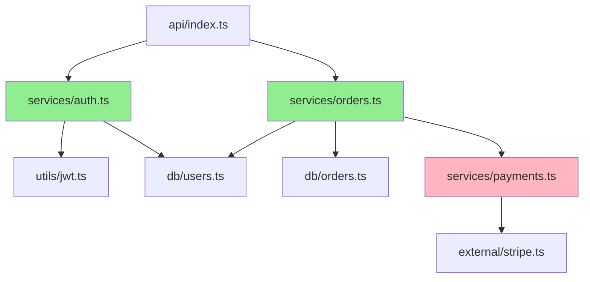

# 🤖 Claude Code Agent Collection

[](LICENSE)
[](agents/)
[](https://code.claude.com)

> A curated collection of specialized AI agents designed to supercharge your development workflow with Claude Code.

## 🌟 Why This Exists

As I explored the capabilities of Claude Code, I discovered something powerful: **specialized agents transform how we interact with AI for software development**. Instead of using a single general-purpose assistant, you can deploy domain-specific experts—each with their own focus, methodology, and toolset.

This repository was born from that discovery. I wanted to share the agents I've created with the broader community, knowing that:

- **Specialized agents deliver better results** than generic prompts
- **Reusable agents save time** across projects and teams
- **Shared agents benefit everyone** through collective improvement
- **Learning by example** helps others create their own agents

Whether you're diving into an unfamiliar codebase, refactoring legacy systems, or just want expert assistance for specific tasks, these agents are here to help. Think of them as your specialized consultants, ready to deploy whenever you need them.

## 📚 Available Agents

| Agent | Description | Best For |
|-------|-------------|----------|
| [🏛️ Codebase Archeologist](agents/codebase-archeologist.md) | Expert software architect specializing in code exploration, dependency analysis, and architectural documentation | Understanding system architecture, visualizing dependencies, creating technical documentation, onboarding new developers |

### 🏛️ Codebase Archeologist

The Codebase Archeologist approaches codebases like an archeologist explores ancient ruins—methodically uncovering structure, relationships, and design philosophy. I needed to get up to speed on some sizeable codebases, and this agent helped me achieve that quickly. This agent excels at:

- **Dependency Mapping**: Generate visual dependency graphs and identify architectural issues
- **Architecture Visualization**: Create clear diagrams showing system layers, data flow, and integration points
- **Museum Tour Documentation**: Craft narrative explanations of your codebase that make the complex comprehensible
- **Code Exploration**: Navigate unfamiliar codebases efficiently by identifying patterns and entry points

**Example Use Cases:**
- "Help me understand how the authentication system works in this codebase"
- "Show me what depends on the cart module before I refactor it"
- "Create an architecture overview for onboarding new team members"
- "Explain the purpose of the helpers/ directory in the users module"

## 🚀 Installation

### Prerequisites

- [Claude Code](https://code.claude.com) installed and configured
- Basic familiarity with command line operations

### Quick Install

You can install these agents either for a specific project or globally for all your projects.

#### Option 1: Project-Specific Installation (Recommended for Teams)

Install agents in your project directory so they're available to all team members:

```bash
# Navigate to your project directory
cd your-project

# Create the agents directory
mkdir -p .claude/agents

# Copy the agents you want to use
cp path/to/ai-agents/agents/*.md .claude/agents/
```

**Benefits:**
- Agents are version-controlled with your project
- Team members automatically get the same agents
- Different projects can use different agent versions

#### Option 2: Global Installation (Personal Use)

Install agents globally to use them across all your projects:

```bash
# From this repository directory
mkdir -p ~/.claude/agents
cp agents/*.md ~/.claude/agents/
```

**Benefits:**
- Available in every project without setup
- Ideal for personal workflows
- One-time installation

### Verification

After installation, verify your agents are available:

```bash
# Check project-specific agents
ls .claude/agents/

# Or check global agents
ls ~/.claude/agents/
```

In Claude Code, you can also use the `/agents` command to see all available agents.

## 💡 Usage

Claude Code agents work in two complementary ways, giving you flexibility in how you interact with them.

### Automatic Invocation (Smart Detection)

Claude will **automatically detect and use the appropriate agent** based on your request. The agents' descriptions are designed to trigger on relevant keywords and contexts.

**Examples:**

```
You: "Can you help me understand the architecture of this codebase?"
→ Claude automatically invokes the Codebase Archeologist

You: "I need to see what modules depend on the payment service"
→ Claude automatically invokes the Codebase Archeologist

You: "Create documentation explaining our system design"
→ Claude automatically invokes the Codebase Archeologist
```

The agent descriptions contain specific trigger conditions and examples, so Claude knows when each specialist is needed. Just describe your goal naturally, and Claude will choose the right expert for the job.

### Explicit Invocation (Direct Request)

You can also **explicitly request a specific agent** using natural language or the `@` mention syntax:

**Natural Language:**
```
"Use the codebase-archeologist agent to analyze the authentication flow"
"Have the codebase archeologist create a dependency graph"
```

**@ Mention Syntax:**
```
"@codebase-archeologist analyze the cart module and show me its dependencies"
"@codebase-archeologist create a museum tour document for the API layer"
```

**When to use explicit invocation:**
- You know exactly which specialist you need
- You want to ensure a specific agent is used
- You're comparing outputs from different agents

### Best Practices

- **Start with automatic**: Let Claude choose the agent for most tasks
- **Be specific**: Detailed requests get better results
- **Iterate**: Agents can refine their analysis based on your feedback
- **Combine agents**: Use multiple specialists for complex workflows

## 🎨 Example Outputs

### Architecture Diagram

When you ask the Codebase Archeologist to visualize system architecture, you'll get clean, informative diagrams like this:

```
┌─────────────────────────────────────────────┐
│         Presentation Layer                  │
│  ┌──────────┐  ┌──────────┐  ┌──────────┐ │
│  │   Web    │  │  Mobile  │  │   API    │ │
│  │   App    │  │   App    │  │ Gateway  │ │
│  └──────────┘  └──────────┘  └──────────┘ │
└─────────────────┬───────────────────────────┘
                  │
┌─────────────────▼───────────────────────────┐
│         Business Logic Layer                │
│  ┌──────────┐  ┌──────────┐  ┌──────────┐ │
│  │   Auth   │  │  Orders  │  │ Payments │ │
│  │ Service  │  │ Service  │  │ Service  │ │
│  └──────────┘  └──────────┘  └──────────┘ │
└─────────────────┬───────────────────────────┘
                  │
┌─────────────────▼───────────────────────────┐
│         Data Access Layer                   │
│  ┌──────────┐  ┌──────────┐  ┌──────────┐ │
│  │   User   │  │  Order   │  │ Payment  │ │
│  │   DB     │  │   DB     │  │   DB     │ │
│  └──────────┘  └──────────┘  └──────────┘ │
└─────────────────────────────────────────────┘
```

### Dependency Graph (Mermaid)



### Museum Tour Documentation

The agent creates narrative documentation with sections like:

**The Grand Hall (Main Architecture)**
> "This application follows a three-tier architecture pattern, cleanly separating presentation, business logic, and data access concerns. The API Gateway serves as the single entry point, routing requests to specialized microservices..."

**The Wings (Major Modules)**
> "The Authentication Service acts as the gatekeeper, implementing JWT-based stateless authentication. It coordinates with the User Database and provides tokens that other services validate..."

## 🤝 Contributing

I'd love for this collection to grow with contributions from the community! Whether you've created an amazing agent, improved an existing one, or just have suggestions, your input is valuable.

### Ways to Contribute

- **Share your own agents**: Created a specialized agent? Submit it!
- **Improve existing agents**: Better descriptions, additional capabilities, bug fixes
- **Report issues**: Found a problem? Let me know in the [Issues](../../issues)
- **Suggest new agents**: Ideas for useful specialists
- **Improve documentation**: Typos, clarity, examples

### Submitting an Agent

1. Fork this repository
2. Create your agent file in the `agents/` directory
3. Follow the naming convention: `lowercase-with-hyphens.md`
4. Include proper YAML frontmatter (name, description, tools, model, color)
5. Write a clear system prompt explaining the agent's role and methodology
6. Add your agent to the table in this README
7. Submit a pull request!

### Agent Development Tips

- **Single Responsibility**: Each agent should have one clear focus
- **Trigger Conditions**: Include specific examples in the description to help Claude know when to use it
- **Quality Over Quantity**: One excellent agent beats several mediocre ones
- **Test Thoroughly**: Try your agent on real problems before submitting

## 📄 License

This project is licensed under the MIT License - see the [LICENSE](LICENSE) file for details.

## 🙏 Acknowledgments

- Thanks to [Anthropic](https://www.anthropic.com) for creating Claude Code
- Inspired by the broader Claude Code community and their innovative agent designs
- Special thanks to all contributors who help make this collection better

---

**Built with ❤️ for the developer community**

*Have questions or feedback? [Open an issue](../../issues) or start a discussion!*
