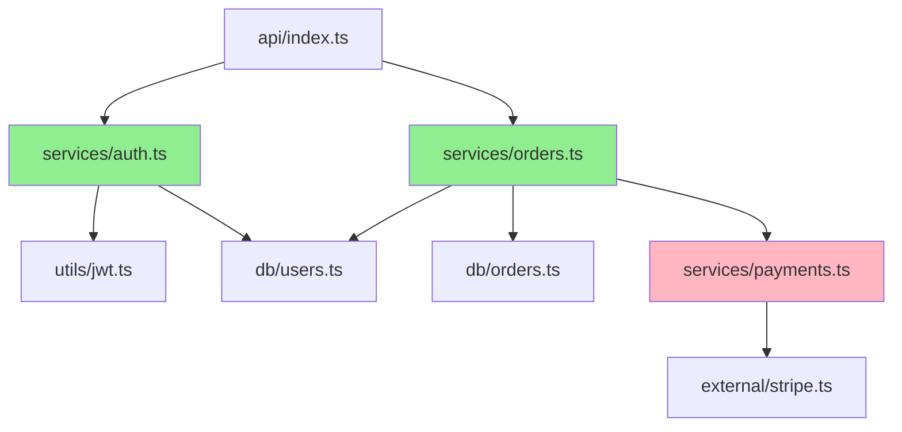

# 🤖 Claude Code Agent Collection

[](LICENSE)
[](agents/)
[](skills/)
[](https://code.claude.com)

> A curated collection of specialized AI agents and skills designed to supercharge your development workflow with Claude Code.

## 🌟 Why This Exists

As I explored the capabilities of Claude Code, I discovered something powerful: **specialized agents transform how we interact with AI for software development**. Instead of using a single general-purpose assistant, you can deploy domain-specific experts—each with their own focus, methodology, and toolset.

This repository was born from that discovery. I wanted to share the agents I've created with the broader community, knowing that:

- **Specialized agents deliver better results** than generic prompts
- **Reusable agents save time** across projects and teams
- **Shared agents benefit everyone** through collective improvement
- **Learning by example** helps others create their own agents

Whether you're diving into an unfamiliar codebase, refactoring legacy systems, or just want expert assistance for specific tasks, these agents are here to help. Think of them as your specialized consultants, ready to deploy whenever you need them.

## 📚 Available Agents

| Agent | Description | Best For |
|-------|-------------|----------|
| [🏛️ Codebase Archeologist](agents/codebase-archeologist.md) | Expert software architect specializing in code exploration, dependency analysis, and architectural documentation | Understanding system architecture, visualizing dependencies, creating technical documentation, onboarding new developers |

### 🏛️ Codebase Archeologist

The Codebase Archeologist approaches codebases like an archeologist explores ancient ruins—methodically uncovering structure, relationships, and design philosophy. I needed to get up to speed on some sizeable codebases, and this agent helped me achieve that quickly. This agent excels at:

- **Dependency Mapping**: Generate visual dependency graphs and identify architectural issues
- **Architecture Visualization**: Create clear diagrams showing system layers, data flow, and integration points
- **Museum Tour Documentation**: Craft narrative explanations of your codebase that make the complex comprehensible
- **Code Exploration**: Navigate unfamiliar codebases efficiently by identifying patterns and entry points

**Example Use Cases:**
- "Help me understand how the authentication system works in this codebase"
- "Show me what depends on the cart module before I refactor it"
- "Create an architecture overview for onboarding new team members"
- "Explain the purpose of the helpers/ directory in the users module"

## 🛠️ Available Skills

Skills are slash commands that you invoke directly with `/skill-name`. Unlike agents (which Claude selects automatically), skills are explicit actions you trigger when needed.

| Skill | Description | Invocation |
|-------|-------------|------------|
| [Smart Commit](skills/smart-commit.md) | Analyse changes and create a conventional commit following the Conventional Commits spec | `/smart-commit [ticket-id] [--no-body] [--split]` |
| [SonarQube Fix](skills/sonarqube-fix.md) | Detect SonarQube bot comments on a PR, fetch issue details from SonarCloud API, and fix or triage each finding | `/sonarqube-fix <pr-url>` |
| [Sentry Fix](skills/sentry-fix.md) | Extract Sentry bot findings on a PR, verify each issue, and fix valid bugs or explain false positives | `/sentry-fix <pr-url>` |

### Smart Commit

Analyses your staged (or unstaged) changes and produces a well-formed conventional commit. It reads recent git history to match your project's commit style, warns about suspicious content (secrets, debug logs), and asks for clarification when changes span unrelated concerns.

**Features:**
- **Conventional Commits**: Automatically formats as `<type>[(scope)]: <description>`
- **Ticket Linking**: Pass a ticket ID to include it in the commit message
- **Split Mode**: Use `--split` to create separate commits for unrelated changes
- **Safety Checks**: Warns about leaked secrets or debug logs before committing

**Example Use Cases:**
```
/smart-commit
/smart-commit PROJ-1234
/smart-commit --no-body
/smart-commit PROJ-1234 --split
```

### SonarQube Fix

Bridges the gap between SonarQube bot comments (which only show summary counts) and the actual issues. This skill fetches full issue details from the SonarCloud API, presents a prioritised summary, and works through each finding — fixing valid issues and explaining false positives.

**Features:**
- **API Integration**: Fetches issues, security hotspots, and rule descriptions from SonarCloud
- **Priority Processing**: Works through findings from BLOCKER/CRITICAL down to INFO
- **Structured Triage**: Observe → Assess → Act workflow for each finding
- **Batch Processing**: Groups findings by file to minimise redundant reads

**Prerequisites:** Requires `SONAR_TOKEN` environment variable ([generate one here](https://sonarcloud.io/account/security))

**Example Use Cases:**
```
/sonarqube-fix https://github.com/org/repo/pull/123
/sonarqube-fix org/repo#123
/sonarqube-fix #123
```

### Sentry Fix

Extracts and resolves Sentry bot findings on a GitHub pull request. Reads each Sentry review comment, extracts the "Prompt for AI Agent" block, verifies whether the issue is real, and either implements the fix or explains why it's a false positive.

**Features:**
- **Automatic Extraction**: Parses severity, bug summary, suggested fix, and AI agent prompt from Sentry comments
- **Severity-First Processing**: Works through HIGH severity findings first
- **Observe → Conclude → Act**: Structured verification before any code changes
- **Minimal Changes**: Targeted fixes that follow existing code style

**Example Use Cases:**
```
/sentry-fix https://github.com/org/repo/pull/123
/sentry-fix org/repo#123
/sentry-fix #123
```

## 🚀 Installation

### Prerequisites

- [Claude Code](https://code.claude.com) installed and configured
- Basic familiarity with command line operations

### Quick Install

You can install these agents either for a specific project or globally for all your projects.

#### Option 1: Project-Specific Installation (Recommended for Teams)

Install agents and skills in your project directory so they're available to all team members:

```bash
# Navigate to your project directory
cd your-project

# Copy agents
mkdir -p .claude/agents
cp path/to/ai-agents/agents/*.md .claude/agents/

# Copy skills (slash commands)
mkdir -p .claude/commands
cp path/to/ai-agents/skills/*.md .claude/commands/
```

**Benefits:**
- Agents and skills are version-controlled with your project
- Team members automatically get the same setup
- Different projects can use different versions

#### Option 2: Global Installation (Personal Use)

Install agents and skills globally to use them across all your projects:

```bash
# From this repository directory
mkdir -p ~/.claude/agents ~/.claude/commands
cp agents/*.md ~/.claude/agents/
cp skills/*.md ~/.claude/commands/
```

**Benefits:**
- Available in every project without setup
- Ideal for personal workflows
- One-time installation

### Verification

After installation, verify everything is available:

```bash
# Check project-specific installation
ls .claude/agents/
ls .claude/commands/

# Or check global installation
ls ~/.claude/agents/
ls ~/.claude/commands/
```

In Claude Code, you can also use the `/agents` command to see all available agents. Skills will appear as slash commands (e.g. `/smart-commit`).

## 💡 Usage

This collection includes two types of tools: **agents** (autonomous specialists) and **skills** (slash commands). They work differently but complement each other.

### Agents — Automatic & Explicit Invocation

Agents are **automatically detected and invoked** based on your request. Their descriptions contain trigger conditions so Claude knows when each specialist is needed.

**Automatic (Smart Detection):**
```
You: "Can you help me understand the architecture of this codebase?"
→ Claude automatically invokes the Codebase Archeologist

You: "I need to see what modules depend on the payment service"
→ Claude automatically invokes the Codebase Archeologist
```

**Explicit (Direct Request):**
```
"Use the codebase-archeologist agent to analyze the authentication flow"
"@codebase-archeologist create a museum tour document for the API layer"
```

### Skills — Slash Commands

Skills are **invoked explicitly** using slash commands. Type the command and Claude executes the skill's workflow.

```
/smart-commit                    → Analyse changes and create a conventional commit
/smart-commit PROJ-1234 --split  → Commit with ticket ID, splitting unrelated changes
/sonarqube-fix #123              → Fix SonarQube issues on PR #123
/sentry-fix org/repo#456         → Fix Sentry findings on a PR
```

### Agents vs Skills

| | Agents | Skills |
|---|---|---|
| **Invocation** | Automatic or explicit | Slash command only |
| **Install to** | `.claude/agents/` | `.claude/commands/` |
| **Best for** | Open-ended exploration and analysis | Repeatable, structured workflows |
| **Arguments** | Described in natural language | Passed after the command |

### Best Practices

- **Start with automatic**: Let Claude choose the agent for exploratory tasks
- **Use skills for workflows**: Structured, repeatable tasks like committing or PR triage
- **Be specific**: Detailed requests get better results
- **Iterate**: Both agents and skills can refine based on your feedback

## 🎨 Example Outputs

### Architecture Diagram

When you ask the Codebase Archeologist to visualize system architecture, you'll get clean, informative diagrams like this:

####  Dependency Graph (Mermaid)


```mermaid
graph TD
    A[api/index.ts] --> B[services/auth.ts]
    A --> C[services/orders.ts]
    B --> D[utils/jwt.ts]
    B --> E[db/users.ts]
    C --> E
    C --> F[db/orders.ts]
    C --> G[services/payments.ts]
    G --> H[external/stripe.ts]

    style B fill:#90EE90
    style C fill:#90EE90
    style G fill:#FFB6C1
```

### Museum Tour Documentation

The agent creates narrative documentation with sections like:

**The Grand Hall (Main Architecture)**
> "This application follows a three-tier architecture pattern, cleanly separating presentation, business logic, and data access concerns. The API Gateway serves as the single entry point, routing requests to specialized microservices..."

**The Wings (Major Modules)**
> "The Authentication Service acts as the gatekeeper, implementing JWT-based stateless authentication. It coordinates with the User Database and provides tokens that other services validate..."

## 🤝 Contributing

I'd love for this collection to grow with contributions from the community! Whether you've created an amazing agent, improved an existing one, or just have suggestions, your input is valuable.

### Ways to Contribute

- **Share your own agents or skills**: Created a specialized agent or useful slash command? Submit it!
- **Improve existing ones**: Better descriptions, additional capabilities, bug fixes
- **Report issues**: Found a problem? Let me know in the [Issues](../../issues)
- **Suggest ideas**: New agents, skills, or improvements
- **Improve documentation**: Typos, clarity, examples

### Submitting an Agent

1. Fork this repository
2. Create your agent file in the `agents/` directory
3. Follow the naming convention: `lowercase-with-hyphens.md`
4. Include proper YAML frontmatter (name, description, tools, model, color)
5. Write a clear system prompt explaining the agent's role and methodology
6. Add your agent to the table in this README
7. Submit a pull request!

### Submitting a Skill

1. Fork this repository
2. Create your skill file in the `skills/` directory
3. Follow the naming convention: `lowercase-with-hyphens.md`
4. Include proper YAML frontmatter (name, description, and optionally allowed_tools, argument-hint, version)
5. Write a clear workflow with structured steps
6. Add your skill to the table in this README
7. Submit a pull request!

### Development Tips

- **Single Responsibility**: Each agent or skill should have one clear focus
- **Trigger Conditions** (agents): Include specific examples in the description to help Claude know when to use it
- **Structured Workflows** (skills): Break complex tasks into numbered steps with clear inputs and outputs
- **Quality Over Quantity**: One excellent contribution beats several mediocre ones
- **Test Thoroughly**: Try on real problems before submitting

## 📄 License

This project is licensed under the MIT License - see the [LICENSE](LICENSE) file for details.

## 🙏 Acknowledgments

- Thanks to [Anthropic](https://www.anthropic.com) for creating Claude Code
- Inspired by the broader Claude Code community and their innovative agent designs
- Special thanks to all contributors who help make this collection better

---

**Built with ❤️ for the developer community**

*Have questions or feedback? [Open an issue](../../issues) or start a discussion!*
